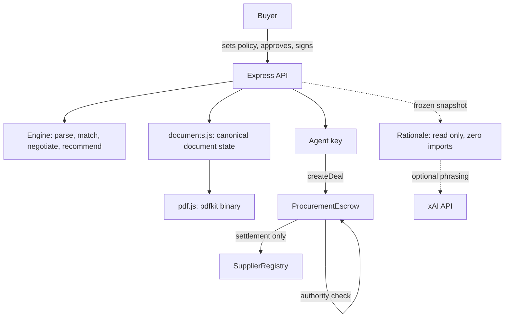

# Covenant

An AI procurement agent that sources suppliers and negotiates deals, where the spending limit is enforced by a smart contract rather than by the agent's own code. Built for B2B teams that buy physical goods: manufacturers, distributors, import and export businesses, and SMEs sourcing across borders.

Vertical in this build: packaging raw materials, PET resin and HDPE.

---

## Try the demo in 60 seconds

```bash
npm install
npm start
```

Open <http://localhost:4000>. No API key, no wallet, no faucet, no second terminal.

1. Click **Try demo workspace**.
2. Leave the prefilled request as it is and click **Run sourcing**.
   `500 kg bottle-grade PET resin, budget $1,200, within 14 days, FDA food-contact certified`
3. Watch the screening step. **Gujarat Polychem is the cheapest listing at $1,090 and is rejected**, for wrong grade, minimum order too large, and missing certification. Price is negotiable; a missing certificate is not.
4. Watch three negotiations. Baltic fails on schedule, Meridian fails on price and the agent **walks away rather than overspending**, Anhui agrees at **$1,175 over 3 rounds**.
5. Read the recommendation, then the **Negotiated Purchase Agreement** below it.
6. Tick the box, type a name, click **Approve and sign**. The document locks and shows a content hash.
7. Click **Publish spending policy on-chain**, then **Force the agent to spend $1,250**.
   The transaction reverts with `ExceedsPerDealCap`. No deal is created and no funds move.
8. Click **Now let the agent raise its own limit**. The agent writes itself a $1,000,000 policy and the transaction *succeeds*. Your ceiling still reads $1,200 and the next spend still fails.
9. Approve and fund the real deal, confirm delivery, release payment. Supplier reputation moves `50.00 → 56.25`, written on-chain by the escrow contract.
10. Download both PDFs.

Step 8 is the point of the project. The agent can change its own record and it buys nothing.

---

## What is different here

**Buyer and agent are separate keys.** `setAgentPolicy` keys off `msg.sender`, so the agent can only ever write a policy for itself while it spends against the buyer's. Privilege escalation is not blocked by a check, it is unrepresentable.

**The spending ceiling is contract state.** The cap is the buyer's own stated budget. `createDeal` reverts above it. The backend deliberately does not pre-check the amount, so the rejection provably comes from the EVM.

**Documents are derived server-side from canonical state.** The routes read nothing from the request body, so no client can alter an amount, a hash, or a settlement figure.

**Workspaces are isolated server-side.** One buyer's request, shortlist, negotiations and documents are never served to another.

---

## The AI pipeline

Two stages, and the order is the design.

**Stage 1, grounded answer.** Deterministic, computed from a frozen projection of
the run. It produces every figure in the reply and cites where each came from.

**Stage 2, phrasing.** The grounded answer is sent to `grok-3-mini` with a system
prompt that forbids introducing any number, name, date or claim that is not in
the input, and forbids removing any figure that is. The model rewrites; it never
computes. It never sees supplier reservation prices, and it never sees a refusal,
because refusals return before Stage 2 is reached.

Output is validated before use: HTTP status, response shape, a minimum length
(a truncated rewrite of a financial answer is discarded rather than shipped), and
sanitisation. Every failure is named and falls back to the grounded answer.

| Failure | Reported as |
| --- | --- |
| No API key | `no-key` |
| Over 8000 ms | `timeout`, via `AbortController` |
| Non-200 | `http-429`, `http-500`, code preserved |
| Host unreachable | `network` |
| Unusable completion | `malformed-completion` |
| Refusal | `refusal-not-sent`, model skipped |

Latency is measured on every call including failures, both stages are timed
separately, and `POST /api/counsel` returns a `pipeline` object with `mode`,
`model`, `localMs`, `modelMs`, `totalMs`, `timeoutMs`, `fallback` and `usage`.
The interface prints it under every answer, so a reader can tell whether a
sentence came from a deterministic function or a language model.

```bash
node scripts/llm-check.js            # live call, latency, figure preservation, all four failure paths
node scripts/llm-check.js --models   # list what the configured provider will serve
```

Screening, negotiation, ranking and every figure in the documents are
deterministic code, not model output. The same request produces the same
transcript every time, and the test suite asserts it.

---

## Architecture



The authority check sits inside `ProcurementEscrow.createDeal`, not in the API layer. Document generation runs `session state -> documents.js -> pdf.js -> PDF binary` with no client input at any step.

| Component | Role |
| --- | --- |
| `server/engine/` | Requirement parsing, supplier matching, bounded negotiation, recommendation. Deterministic. |
| `server/documents.js` | Builds both documents from session and chain state. Signing, versioning, content hash. |
| `server/pdf.js` | Renders real PDF binaries with pdfkit. |
| `server/counsel.js` | Rationale: explains a run. Zero imports, so it holds no capability to act. The module and its `/api/counsel` route keep an earlier name; the feature is called Rationale in the interface. |
| `server/workspace.js` | Per-workspace session isolation. |
| `contracts/` | `ProcurementEscrow`, `SupplierRegistry`, `MockUSDC`. |

---

## Quickstart

Requires **Node.js 18 or newer**. Nothing else.

```bash
git clone https://github.com/sujal128005/Covenant.git
cd Covenant
npm install
npm start
```

Open <http://localhost:4000>.

First boot takes 10 to 25 seconds: the server compiles the Solidity contracts with solc-js, starts an in-process EVM, deploys, registers suppliers on-chain, and funds the buyer. There is no separate seed step.

---

## Environment variables

The product runs fully with none of these set.

| Name | Required | Default | Description |
| --- | --- | --- | --- |
| `LLM_API_KEY` | Optional | none | Lets Rationale phrase its answers through a model. Server-side only. Without it Rationale runs locally and behaves identically. |
| `LLM_BASE_URL` | Optional | `https://api.x.ai/v1` | Any OpenAI-compatible chat completions API. Point it at Groq, OpenAI or OpenRouter without a code change. |
| `LLM_MODEL` | Optional | `grok-3-mini` | Model used when a key is present. |
| `XAI_API_KEY`, `XAI_MODEL` | Optional | none | Legacy names, still honoured. |
| `PORT` | Optional | `4000` | Application port. |
| `RPC_URL` | Optional | none | Point at any EVM JSON-RPC endpoint, for example Base Sepolia, instead of the in-process chain. |
| `DEPLOYER_KEY` | Optional | none | Required when `RPC_URL` is set. |
| `AGENT_KEY` | Optional | none | Gives the agent its own key on a public network. On the local chain it already has a separate account. |

Copy `.env.example` to `.env` to set any of them. Never put real values in `.env.example`.

---

## Documents

Two documents bracket the money, both generated programmatically server-side with **pdfkit**. There is no browser printing, no print stylesheet, and no HTML-to-PDF conversion anywhere in the path.

**Negotiated Purchase Agreement**, issued after negotiation and before payment. Carries the line item with the list price struck through against the negotiated price, delivery terms, a framed spending authority panel showing authorised limit, commitment and remaining headroom, the suppliers that were not selected with reasons, ruled signature blocks, and a verification section with document ID, version, status and content hash.

**Settlement Record**, issued only after funds leave escrow. Carries the final amount, platform fee, saving against list, delivery confirmation, all three transaction hashes, the terms hash, and the reputation move.

Both documents render in the workspace as a document sheet with a letterhead, line items, an authority panel and an approval block. **Preview PDF** opens the real generated binary inside the app, so what you inspect before downloading is the file itself rather than an HTML mock of it.

Sample files generated from seed data:

- [docs/samples/sample-purchase-agreement.pdf](docs/samples/sample-purchase-agreement.pdf)
- [docs/samples/sample-invoice.pdf](docs/samples/sample-invoice.pdf)

Regenerate them with `node scripts/samples.js`. They come from the real engine and the real renderer, not from a mockup.

Both are byte-deterministic: regenerating the same document produces an identical file, so a content hash is meaningful. Both remain legible when printed in grayscale.

---

## Security model

The threat is an agent that is buggy, jailbroken, prompt-injected, or outright compromised, and a client that lies. The design assumes the agent will eventually misbehave and places the spending limit somewhere the agent cannot reach: contract state written by a different key.

| Enforced | Where |
| --- | --- |
| Spending ceiling | `ProcurementEscrow.createDeal`, reverts with `ExceedsPerDealCap` |
| Agent cannot widen the buyer's mandate | `setAgentPolicy` keys off `msg.sender` |
| Only the nominated agent may spend | `NotAuthorisedAgent` |
| Reputation writes | `SupplierRegistry`, callable only by the escrow |
| Document values | Server-derived, request body ignored |
| Workspace data | `server/workspace.js`, server-side check |
| Rationale cannot act | `server/counsel.js` has zero imports |

```bash
npm test              # includes contract, red team, and adversarial input suites
node scripts/e2e.js   # live security assertions against a running server
```

---

## Testing

```bash
npm test                   # 96 tests
node scripts/e2e.js        # ~100 assertions against a live server and chain
node scripts/llm-check.js  # live LLM call, latency, and all four failure paths
```

- **Contracts, 36.** Escrow lifecycle, policy caps, expiry, revocation, reputation math, access control.
- **Red team, 13.** Cross-buyer spending, agent replacement, stale policies, double confirmation, non-existent deals.
- **Engine, 20.** Parsing, structural versus negotiable failures, ceiling adherence, walk-away, determinism.
- **Adversarial, 4.** Prompt injection in the request, hostile supplier text, doctored caller figures.
- **Rationale, 18.** Capability boundary, frozen snapshot, refusals, canonical figures.
- **LLM pipeline, 7.** Named fallbacks, timeout distinct from network, non-200 codes, unusable completions, latency always reported.
- **PDF, 15.** Real binaries, metadata, signing, versioning, hash stability, footers on every page.

---

## What is demo-grade

Stated plainly, because these are the first things a careful reviewer will ask.

- **The e-signature is not legally binding.** It records a typed name, a timestamp and a content hash. It is not a qualified electronic signature and makes no compliance claim.
- **The chain is local.** A real EVM with real gas, reverts and transaction hashes, but not a public network, so there is no block explorer link. `RPC_URL` switches it to Base Sepolia unchanged.
- **Supplier data is seeded.** Eight suppliers shaped like a directory API response, not a live feed.
- **Supplier negotiating behaviour is simulated.** Counterparties hold private reservation prices the agent cannot read, which makes the bargaining real, but they are not real firms.
- **Delivery is confirmed by the buyer**, not by a carrier or inspector. This bounds the reputation claim: the contract controls *when* reputation is written, but a buyer and supplier acting together could still settle a deal that never shipped. Oracle-backed proof of delivery is the fix and it is not in this build.
- **USDC is a mock 6-decimal ERC-20** on the local chain.
- **One buyer identity per deployment.** Workspaces isolate off-chain data; the on-chain buyer is shared in this build.

---

## Roadmap

Oracle-backed delivery attestation, additional sourcing verticals, per-workspace buyer wallets, and supplier-side agents so both parties negotiate under their own mandates.

## Documentation

- [TECHNICAL_DOCUMENTATION.md](TECHNICAL_DOCUMENTATION.md), architecture, the AI pipeline, the security model, testing and limitations.
- [DEMO_SCRIPT.md](DEMO_SCRIPT.md), the walkthrough used for the demo video.
- [PROJECT_STATE.md](PROJECT_STATE.md), engineering handoff notes and the decisions that must not be reversed.

## Team

**Nexara9**

- M. Navya, 124CS0001, IIITDM Kurnool
- Sujal Negi, 123ME0023, IIITDM Kurnool

## License

MIT. See [LICENSE](LICENSE).
